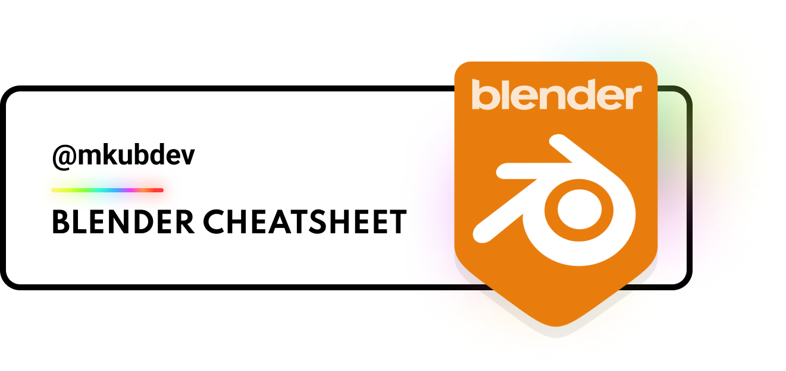

# Blender Cheatsheet

A list of Blender 3.0+ resources for Developers ⚡

# Getting started 🎨

This repository is built with the help of the [WebXDAO](https://webxdao.github.io) community.

## Shortcuts

Using Blender without shortcuts is a pain, this list contain all shortcuts to ensure you're working efficiently!

- 💻 [I use Windows](#windows-shortcuts)
- 🍎 [I use Apple](#apple-shortcuts)

## Windows Shortcuts

This list all Windows shortcuts for Blender 3.0+

## 🍿 Universal

|               Keys               |                                          Action                                          |
| :------------------------------: | :--------------------------------------------------------------------------------------: |
|          <kbd>ESC</kbd>          |                        Cancel Blender functions / current action                         |
|         <kbd>SPACE</kbd>         |                                 Open the Blender Toolbox                                 |
| <kbd>CTRL</kbd>+<kbd>SPACE</kbd> | Opens menu with manipulator type choices (Press 2, 3, 4, or 5 to change the widget type) |
| <kbd>ALT</kbd>+<kbd>SPACE</kbd>  |                    Opens a menu with manipulator orientation choices                     |

## Apple Shortcuts

This list all Apple OsX shortcuts for Blender 3.0+
